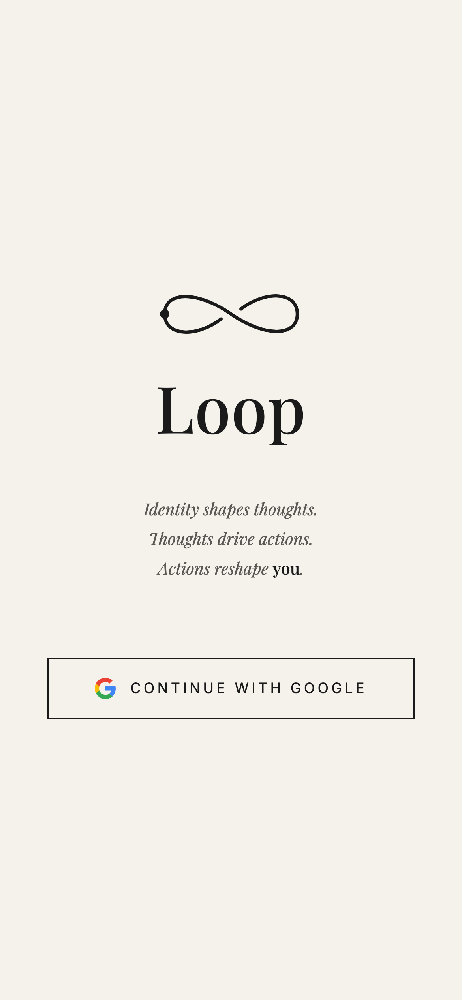
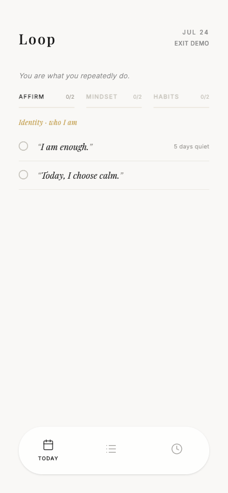
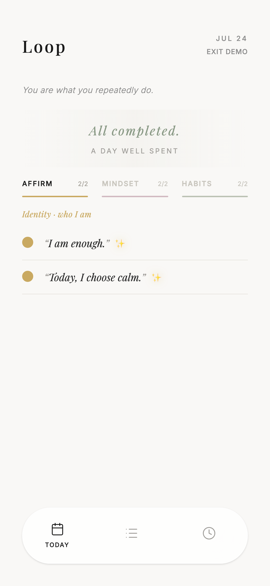
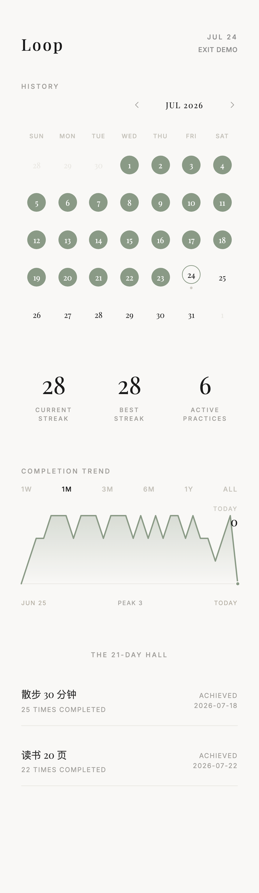

# Loop — 把「思维 → 感受 → 行动」做成每日循环

> 给想靠微习惯改变自我认知、却总是三分钟热度的人的每日练习 PWA，解决「打卡 App 功能繁杂、核心功能还收费，且只管行为、不管你想成为谁」的问题。

> *Thoughts create feelings. Feelings drive actions. Actions shape you.*

在线体验：[loop-365.vercel.app](https://loop-365.vercel.app) · 免登录试用：[?demo=1](https://loop-365.vercel.app/?demo=1)

## 为什么做这个

起点很简单：想要一个每天带自己过一遍「肯定语 + 心态 + 习惯」的工具。市面上的打卡 App 试下来都不对味：功能越堆越多，核心功能还要订阅付费；更根本的是，它们只记录「今天做没做」——行为孤零零挂着，链条一断就整个弃用，因为行为没有挂在更深的东西上。而心理学对「改变」的解释恰恰不是从行为开始的：想法创造感受，感受驱动行为，行为再反过来塑造身份认同。所以做了一个「思维 → 感受 → 行动」的每日循环：把练习拆成三层——Affirmations（我是谁）、Mindsets（我怎么想）、Habits（我做什么）——以终为始，每天从身份宣言开始、以行动收尾，一天一屏过完，循环闭合才算完成。

## 循环背后的原理

三层设计不是仪式感，每层背后有对应的心理学 / 脑科学依据：

- **想法层（Affirmations）** —— 自我肯定理论及其脑成像研究：肯定语练习会激活前额叶的自我加工与奖赏回路，降低面对困难时的防御反应，让人更倾向行动。所谓「显化」，剥掉玄学外壳后的科学内核是**选择性注意**：每天先声明「我是谁、我看重什么」，注意系统就会优先捕捉与之一致的机会和证据。
- **感受层（Mindsets）** —— 认知行为疗法（CBT）的认知三角：感受不是凭空来的，由想法和信念中介；积极心理学的扩展-建构理论进一步指出，积极情绪会拓宽人的行动选择空间，而不只是「感觉良好」。
- **行动层（Habits）** —— 神经可塑性（赫布定律：一起放电的神经元连在一起）：每天重复的小练习在物理层面强化神经通路；行为再通过自我知觉反哺身份——「我做到了」一点点积累成「我是这样的人」。

打卡 App 只做了第三层。Loop 把三层做成一个每天闭合一次的循环。

## 核心功能

- ✅ Today 每日仪式 —— AFFIRM / MINDSET / HABITS 三个子 tab 滑动切换，每段独立进度条，全部完成撒花；每天强制从 Affirmations 开始（仪式从身份宣言起步）
- ✅ Practice 练习管理 —— 三个模块各自增删改：左滑编辑/删除，按住行首编号拖拽排序，排的顺序就是 Today 的练习顺序；练习定义一次，每天自动物化成当日任务，确定性 ID 保证跨设备不重复、不丢已打的勾
- ✅ History 历史回顾 —— 日历热图、连击统计、周趋势，点任意一天看当日完成明细；坚持满 21 天的习惯进名人堂（肯定语/心态是锚定仪式，特意不进堂）
- ✅ 离线可用的 PWA —— 加到主屏当 App 用，断网照常打卡、恢复自动同步；每晚 22:00 对未完成任务发 Web Push 提醒
- ✅ Google 登录多端实时同步 —— 手机勾完，电脑立即可见

## 效果展示

<p>
  
  
  
  
</p>

免登录预览：[loop-365.vercel.app/?demo=1](https://loop-365.vercel.app/?demo=1)（内存假数据，不写库）

## 快速开始

```bash
npm install
npm run dev     # http://localhost:3000/?demo=1 免 Firebase 配置直接看完整 UI
```

Firebase 客户端配置随仓库提供（`firebase-applet-config.json`，Web 端配置本就是公开的，数据安全由 Firestore rules 的 owner-only 校验守护）。自部署要换成自己的 Firebase 项目配置，并在 Firebase Console 把部署域名加进 Auth 授权域名。唯一的环境变量 `VITE_FIREBASE_VAPID_KEY`（Web Push 公钥）只有推送提醒功能需要。

测试：`npm run test`（144 个单测）· `npm run test:e2e`（Playwright）。

## 技术方案（简）

React 19 + Vite + Tailwind 4 + Motion；Firebase Auth / Firestore（IndexedDB 离线缓存 + onSnapshot 实时监听，无 Redux/Zustand）；Cloud Functions 定时发 Web Push；vite-plugin-pwa autoUpdate。数据流：练习定义（microHabits）与当日任务（tasks）两个集合实时驱动 UI；「每日重置 effect」是任务生成的唯一入口；History 页全部由客户端纯计算，不落冗余数据。

## 设计取舍

1. 从 window 滚动改为有界容器内滚动（`be0ab5e`）：三 tab 横向 pager 与 window 滚动互相污染滚动位置，切回 Today 会停在陈旧位置；代价是要用 `useLayoutEffect` 自己量可用高度，为此抽了纯函数并配单测。
2. 子 tab 记忆「按天生效」而非永久记忆（`ecabc8d`）：当天内切走再回来保持原位，但新的一天强制回到 Affirmations——练习顺序是产品立场，不完全交给用户惯性；代价是 localStorage 要存 `{tab, day}` 并处理 PWA 跨夜常驻的边界。
3. Mood 情绪模块整体隐藏而非删除（2026-07-03）：做完上线后试用发现打断每日主仪式的节奏，先撤出导航、代码与独立数据集合完整保留，试用期后再定去留；代价是包里躺着一块暂不可见的功能。

## Roadmap

- [ ] Mood 模块去留拍板（试用性下线中，代码完整保留，数据结构独立）
- [ ] 清理 Becoming → Loop 更名的迁移遗留（`LEGACY_HAD_SESSION_KEY` 的 30 天窗口已过）

## License

MIT — 见 [LICENSE](./LICENSE)
